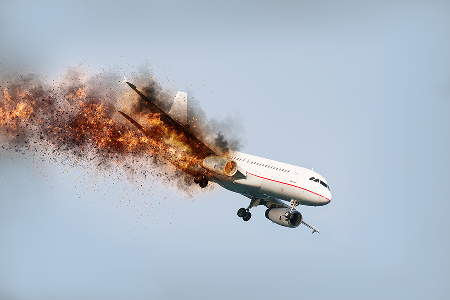
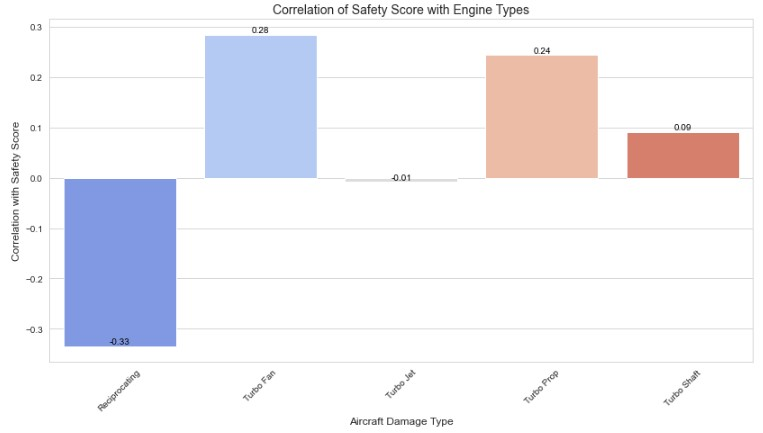
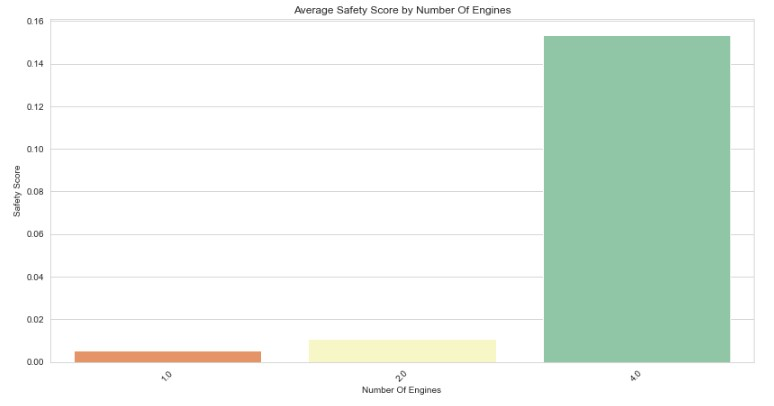

# Aircraft Safety Analysis
**Author**: [Emma Mackoy](mailto:emmamackoy@gmail.com)

## Introduction:

Aviation safety is a crucial consideration for the industry and the public. Understanding the factors contributing to aviation accidents can lead to more effective regulations, training procedures, and safety protocols, ultimately saving lives. In this project, I delve deep into the aviation accident data to uncover patterns, trends, and potential areas of improvement. 

## Business Problem:

The primary goal of this analysis is to gain insights into causes and consequences of aviation accidents as your company expands into commercial and private aviation. Before I do so, it's essential to understand the risks associated with aviation. Specifically, I aim to answer:

1. Does the type of aircraft or engine play a role in the frequency or severity of accidents?
2. Are there specific regions or countries with higher accident severity rates? 

To answer these questions, I'll be working with a comprehensive dataset that contains detailed information about aviation accidents including location, aircraft details, and the resulting injuries or fatalities. 

## Data:

1. **AviationData.csv**: This is our [primary dataset](https://www.kaggle.com/datasets/khsamaha/aviation-accident-database-synopses) which encompasses aviation accident data spanning from 1962 - present. This is provided from the [National Trasportation Safety Board](https://www.ntsb.gov/Pages/home.aspx) and encompasses various attributes related to each aviation accident such as location, injury severity, and engine type, among others.  
3. **aircraft_data.csv**: Sourced from Kaggle, this [Aircraft Production Dataset](https://www.kaggle.com/datasets/alvaroibrain/aircraft-production-data) is an exhaustive catalogue detailing various aircraft attributes including production rates. 
5. **world_population.csv**: Another dataset sourced from [Kaggle](https://www.kaggle.com/datasets/iamsouravbanerjee/world-population-dataset), this provides populations by country. 

## Methodology:

1. **Data Cleaning**: My intial step involves processing the data, addressing missing values, and ensuring the data is formatted correctly for our analysis. 
2. **Exploratory Data Analysis (EDA)**: Through visualizations and statistical analyses, I'll uncover the primary trends and patterns in the data.
4. **Conclusions**: Based on my analyses, I'll draw conclusions and provide recommendations for enhancing aviation safety.

## Results:

1. Aircraft with turbofan and turbo prop engines tend to be associated with higher safety scores, suggesting they are generally safer.

3. Aircraft with 4 engines have higher average safety scores compared to those with 1 or 2 engines.

4. While North America yeilds the highest destruction percentage, it's important to note that this predominance may be skewed due to North America being overrepresented in the dataset. Additionally, the data indicates a markedly higher risk associated with flights over South America and International Waters.


## For More Information

See the full analysis in the [Jupyter Notebook](./air-safety-analytics.ipynb), review this [presentation](./Air_Safety_Analysis_Presentation.pdf) or this [interactive dashboard](https://public.tableau.com/app/profile/emma.mackoy3448/viz/Aircraft_Safety_Analysis_Dashboard/Dashboard1?publish=yes).

For additional info, contact Emma Mackoy at [emmamackoy@gmail.com](mailto:emmamackoy@gmail.com)


## Repository Structure

```
├── data
├── images
├── .gitignore
├── Aircraft_Safety_Analysis_Presentation.pdf
├── README.md
└── aircraft_safety_analysis.ipynb
```
